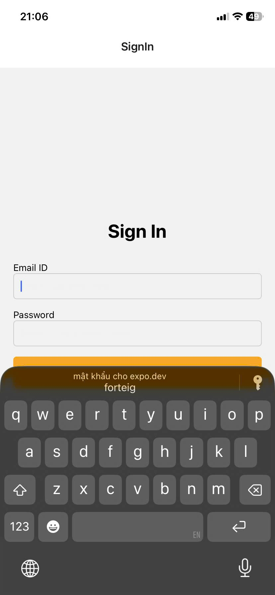
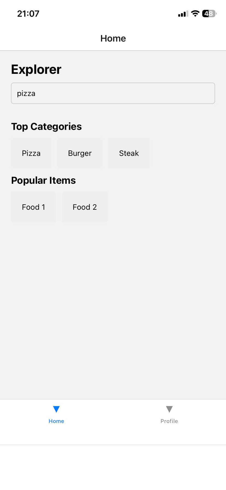

Vũ Tiến Mạnh - 23810310375 
Đây là ứng dụng mobile đơn giản được xây dựng bằng React Native (Expo) nhằm minh họa cách sử dụng React Navigation và React Context API để tạo luồng đăng nhập cơ bản.

Ứng dụng gồm màn hình Sign In để người dùng đăng nhập. Sau khi đăng nhập thành công, hệ thống chuyển sang giao diện chính gồm Bottom Tab Navigation với hai màn hình: Home (Explorer) và Profile (Account). Tại màn hình Profile, người dùng có thể Sign Out để quay lại màn hình đăng nhập.

Công nghệ sử dụng

React Native (Expo)

React Navigation

React Context API

TypeScript

Chức năng chính

Đăng nhập đơn giản

Điều hướng giữa các màn hình bằng Stack Navigation

Điều hướng bằng Bottom Tab Navigation

Quản lý trạng thái đăng nhập bằng Context API

Đăng xuất và quay lại màn hình đăng nhập
## demo giao diện 

